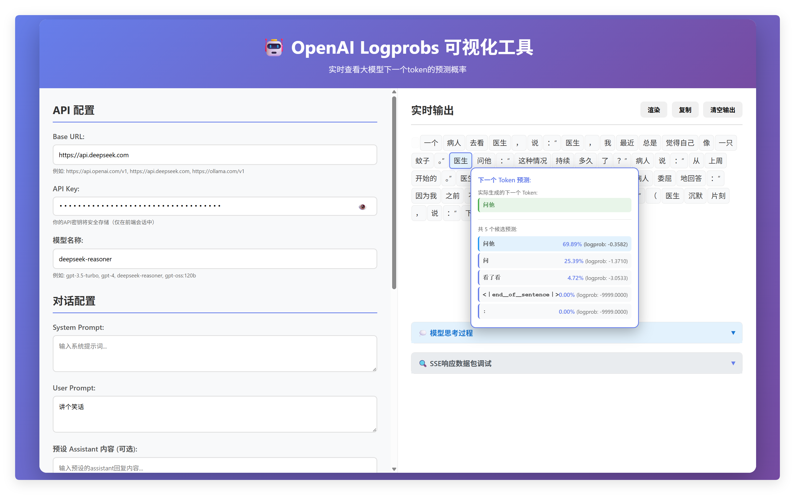

<div align="center">

# 🎯 OpenAI/Ollama Logprobs 可视化工具

**一个优雅的工程化Web应用，用于实时可视化OpenAI或Ollama模型的token预测概率**

[](https://www.python.org/)
[](https://fastapi.tiangolo.com/)
[](LICENSE)



[功能特性](#-功能特性) • [快速开始](#-快速开始) • [使用说明](#-使用说明) • [技术栈](#-技术栈)

</div>

---

## ✨ 功能特性

<table>
<tr>
<td width="50%">

**🚀 实时流式响应**
- 支持OpenAI/Ollama API的流式响应
- 实时显示生成的token
- 流畅的用户体验

**🎨 交互式可视化**
- 鼠标悬浮在任意token上
- 查看该token的下一个token预测概率
- 直观的概率展示

</td>
<td width="50%">

**⚙️ 灵活配置**
- 支持自定义system prompt和user prompt
- 可保存和加载预设的assistant对话内容
- 丰富的参数配置选项

**💎 现代化UI**
- 渐变设计和响应式布局
- 美观的用户界面
- 支持多种模型配置

</td>
</tr>
</table>

---

## 🚀 快速开始

### 1️⃣ 安装依赖

```bash
pip install -r requirements.txt
```

### 2️⃣ 配置API密钥

创建 `.env` 文件，添加你的API配置：

#### 📌 Ollama配置示例

```env
BASE_URL=https://ollama.com/v1
API_KEY=your_ollama_api_key_here
MODEL_NAME=gpt-oss:120b
```

#### 📌 OpenAI配置示例

```env
BASE_URL=https://api.openai.com/v1
API_KEY=your_openai_api_key_here
MODEL_NAME=gpt-3.5-turbo
```

> 💡 **提示**: 也可以使用旧的配置方式（向后兼容）：
> ```env
> OPENAI_API_KEY=your_openai_api_key_here
> ```

### 3️⃣ 启动服务

**方式一：直接运行**
```bash
python main.py
```

**方式二：使用uvicorn**
```bash
uvicorn main:app --reload --host 0.0.0.0 --port 8000
```

### 4️⃣ 访问应用

打开浏览器访问：**http://localhost:8000** 🌐

---

## 📖 使用说明

### 基本使用流程

1. **配置输入内容** 📝
   - **System Prompt**: 系统提示词（可选）
   - **User Prompt**: 用户提示词（**必填**）
   - **预设 Assistant 内容**: 预设的assistant回复（可选）

2. **调整参数** ⚙️
   | 参数 | 说明 | 示例 |
   |------|------|------|
   | **模型** | 模型名称 | `gpt-oss:120b`, `gpt-3.5-turbo`, `gpt-4` |
   | **Temperature** | 控制随机性 | `0-2` |
   | **Max Tokens** | 最大生成token数 | `1000` |
   | **Top Logprobs** | 显示前N个最可能的token | `1-20` |

3. **开始生成** 🎬
   - 点击"发送"按钮开始生成
   - 实时查看输出结果
   - 鼠标悬浮在任意token上查看下一个token的预测概率

### 预设对话管理 💾

<div align="left">

1. 📝 输入预设名称
2. ✏️ 填写system prompt和/或assistant内容
3. 💾 点击"保存预设"
4. 🔄 点击预设列表中的项可以快速加载到输入框

</div>

---

## 🛠️ 技术栈

<div align="center">

| 类别 | 技术 |
|------|------|
| **后端框架** | FastAPI |
| **API客户端** | OpenAI Python SDK |
| **前端技术** | 原生HTML/CSS/JavaScript |
| **通信协议** | Server-Sent Events (SSE) 流式传输 |

</div>

---

## ⚠️ 注意事项

> ⚡ **重要提示**
> 
> - ✅ 确保你的API密钥有效且有足够的余额
> - ✅ 某些模型可能不支持logprobs参数，请查看相应API文档
> - ✅ logprobs功能会增加API调用的成本
> - ✅ Ollama API需要确保BASE_URL正确配置（如 `https://ollama.com/v1`）

---

## 📁 项目结构

```
agent_prompt/
├── 📄 main.py              # FastAPI后端主文件
├── 📄 config.py            # 配置文件
├── 📄 requirements.txt     # Python依赖
├── 📄 README.md           # 项目说明（本文件）
├── 📄 .env.example        # 环境变量示例
└── 📂 static/             # 静态文件目录
    ├── 📄 index.html      # 前端HTML
    ├── 📄 style.css       # 样式文件
    └── 📄 app.js          # 前端JavaScript
```

---

<div align="center">

**⭐ 如果这个项目对你有帮助，请给它一个星标！**

Made with ❤️ by [ZheFox]

</div>


